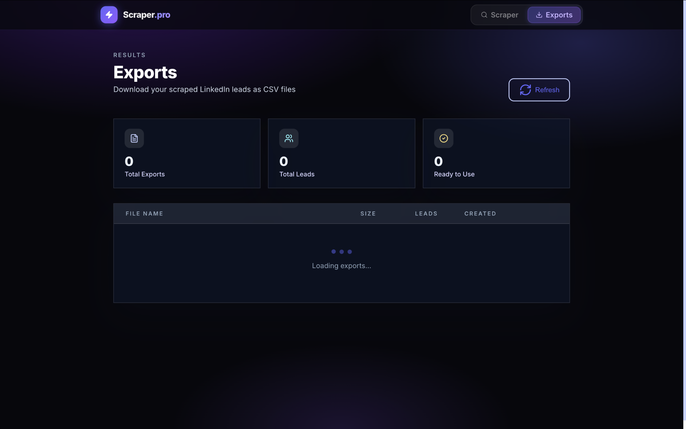

# LinkedIn Scraper — AI-Powered Lead Extraction Platform

> **A browser-assisted LinkedIn scraping and lead extraction platform that turns natural-language search requirements into structured, downloadable CSV datasets.**

## 📌 Project Description

**LinkedIn Scraper** is a browser-assisted lead-generation and data-extraction application designed to make targeted LinkedIn research faster and easier.

Instead of manually searching LinkedIn and copying profiles one by one, the user describes the type of people or companies they want to find in plain English. The application then launches a browser-based LinkedIn workflow, prompts the user to authenticate with LinkedIn, and begins collecting matching profile data.

Once the extraction process is complete, the collected records are made available through a dedicated **Exports** section, where the resulting lead dataset can be downloaded as a **CSV file** for further analysis, CRM import, outreach, or lead-management workflows.

> **Important:** The application is intended for authorized and compliant use. Users should ensure that their use of LinkedIn data, automated browsing, and exported information complies with LinkedIn's applicable terms, policies, privacy requirements, and local laws.

---

## ✨ Core Concept

The platform follows a simple workflow:

```text
Natural-Language Search
        ↓
Enter Scraping Requirement
        ↓
Launch Browser
        ↓
LinkedIn Authentication
        ↓
Automated Search / Extraction
        ↓
Collect Structured Profile Data
        ↓
Process & Store Leads
        ↓
Exports Dashboard
        ↓
Download CSV
```

The main objective is to remove repetitive manual research from the lead-generation process while keeping the search requirement simple and human-readable.

---

# 🖥️ Application Screenshots

## 1. Scraper Interface

The main interface allows the user to describe who they want to find on LinkedIn using natural language.

For example, a user can specify a niche such as:

- SaaS founders
- Startup founders
- CEOs
- Marketing executives
- Investors
- Software companies
- Professionals in a particular location
- People matching a specific business profile

The application then starts the extraction workflow based on the submitted requirement.


---

## 2. Export Dashboard

After extraction, collected data is made available through the **Exports** page.

The dashboard provides an organized view of generated exports, including information such as:

- Export files
- Number of leads
- Export status
- File size
- Creation date
- Ready-to-use datasets

The extracted dataset can then be downloaded as a CSV file.



---

# 🚀 How It Works

## Step 1 — Describe What You Want to Find

The user enters a natural-language requirement describing the target audience or niche.

Example:

```text
Find startup founders in the United States
```

or:

```text
Find CEOs of SaaS companies in London
```

The idea is to allow users to define their target without having to manually configure multiple complicated search filters.

---

## Step 2 — Start the Scraping Workflow

After submitting the search requirement, the application initiates the browser-assisted extraction process.

The workflow opens a browser session for LinkedIn interaction.

---

## Step 3 — LinkedIn Authentication

The user is prompted to sign in to LinkedIn through the browser session.

This approach keeps the authentication step user-controlled instead of requiring the application to collect or store the user's LinkedIn password.

```text
Application
     ↓
Browser Session
     ↓
LinkedIn Login
     ↓
User Authentication
     ↓
Authorized Session
```

---

## Step 4 — Active Extraction

Once authentication is completed, the scraper begins processing the requested search.

The extraction phase can collect structured information from matching LinkedIn profiles according to the configured workflow.

The interface provides extraction progress information so the user can monitor the process.

Typical progress information can include:

- Current search/query
- Profiles processed
- Profiles scraped
- Leads saved
- Errors encountered
- Overall extraction progress

---

## Step 5 — Data Processing

Collected records are processed into a structured dataset.

The purpose of this processing stage is to transform browser-collected information into a format that can be easily used outside the application.

---

## Step 6 — Export to CSV

After extraction is complete, the generated dataset becomes available from the **Exports** dashboard.

Users can download the resulting lead list as a CSV file.

CSV makes the data compatible with many common workflows, including:

- CRM systems
- Spreadsheet applications
- Lead-management platforms
- Business intelligence tools
- Data analysis workflows
- Outreach systems

---

# 🔍 Main Features

## Natural-Language Scraping Queries

Users can describe their target audience using ordinary language instead of manually configuring complex search parameters.

---

## AI-Assisted Search Interpretation

The application is designed around an AI-assisted workflow where the user's natural-language requirement can be translated into a targeted extraction task.

This makes the interface accessible to users who may not understand technical scraping configuration.

---

## Browser-Assisted LinkedIn Workflow

The application uses a browser-based workflow for LinkedIn interaction.

This enables the user to authenticate through the browser before the extraction process begins.

---

## Active Scraping

Once the workflow begins, the application actively processes the requested LinkedIn search and collects matching records.

The scraper can operate through a defined extraction workflow rather than requiring the user to manually copy information from each result.

---

## Progress Monitoring

The extraction interface provides live-style progress information such as:

```text
Profiles Scraped
Profiles Saved
Extraction Progress
Errors
Current Query
```

This makes the scraping process easier to monitor.

---

## Lead Collection

Extracted profiles are treated as structured lead records that can be processed and exported.

This makes the system useful for:

- Lead generation
- Prospect research
- Market research
- Sales research
- Business development
- Recruiting research
- Audience discovery

---

## Export Management

The dedicated Exports dashboard allows users to review generated datasets.

The interface can display:

- Total exports
- Total leads
- Ready-to-use exports
- File names
- File sizes
- Lead counts
- Creation dates

---

## CSV Export

The primary output format is CSV.

This makes extracted data easy to move into other business systems and tools.

Example workflow:

```text
LinkedIn
   ↓
Scraper
   ↓
Structured Leads
   ↓
CSV Export
   ↓
CRM / Spreadsheet / Analytics
```

---

# 🎯 Use Cases

## Sales Prospecting

Build targeted prospect lists based on specific roles, industries, locations, or company characteristics.

## Lead Generation

Identify potential business leads from defined LinkedIn niches.

## Market Research

Collect structured information for analyzing a specific professional or business segment.

## Recruitment Research

Discover professional profiles matching defined roles or industry requirements.

## Startup & Investor Research

Research founders, executives, startups, and investors within selected markets.

## Business Development

Create structured prospect datasets that can be transferred into downstream business-development workflows.

---

# 📊 Example Workflow

Suppose a user wants to find SaaS founders in a particular market.

```text
User enters:
"Find SaaS founders in London"

          ↓

Scraper interprets request

          ↓

Browser opens LinkedIn

          ↓

User signs in

          ↓

Extraction starts

          ↓

Matching profiles are processed

          ↓

Leads are saved

          ↓

Export is generated

          ↓

CSV downloaded
```

The resulting file can then be used for further research, CRM enrichment, or authorized outreach workflows.

---

# 🧱 Application Architecture

At a high level, the system can be understood as several connected layers:

```text
┌─────────────────────────────┐
│        User Interface       │
│  Natural Language Search    │
└──────────────┬──────────────┘
               │
               ▼
┌─────────────────────────────┐
│       Search / AI Layer     │
│ Query Interpretation        │
│ Extraction Configuration    │
└──────────────┬──────────────┘
               │
               ▼
┌─────────────────────────────┐
│     Browser Automation      │
│   LinkedIn Interaction      │
└──────────────┬──────────────┘
               │
               ▼
┌─────────────────────────────┐
│     Extraction Pipeline     │
│ Profile Collection          │
│ Data Processing             │
└──────────────┬──────────────┘
               │
               ▼
┌─────────────────────────────┐
│       Lead Storage          │
└──────────────┬──────────────┘
               │
               ▼
┌─────────────────────────────┐
│       Export System         │
│          CSV                │
└─────────────────────────────┘
```

---

# 📁 Project Output

The primary output of the application is a structured lead dataset.

A typical CSV export can be used as a portable dataset for downstream systems.

Example conceptual structure:

```csv
Name,Job Title,Company,Location,Profile URL
John Doe,CEO,Example SaaS,London,https://...
Jane Smith,Founder,Example Startup,London,https://...
```

> The exact fields included in an export depend on the scraper configuration and the information available during the extraction workflow.

---

# ⚡ Why This Project?

Traditional lead research often requires users to:

1. Open LinkedIn
2. Search manually
3. Review profiles individually
4. Copy information
5. Paste it into spreadsheets
6. Clean the data
7. Repeat the process

This project aims to reduce that repetitive workflow by introducing a conversational search interface and an automated extraction pipeline.

Instead of manually navigating through every profile, the user defines the desired audience and lets the application handle the repetitive research process.

---

# 🔐 Authentication & Privacy

The application is designed around a browser-assisted authentication flow.

Users authenticate directly through the LinkedIn browser session before extraction begins.

### Security principles

- Do not store LinkedIn passwords in application code.
- Do not commit authentication credentials to Git.
- Keep secrets in environment variables.
- Use secure browser sessions.
- Protect exported lead data.
- Restrict access to generated datasets.
- Follow applicable privacy and data-protection requirements.

---

# ⚠️ Responsible Use

This project should only be used for legitimate, authorized, and compliant data-collection purposes.

Users are responsible for ensuring that their scraping activity complies with:

- LinkedIn's applicable terms and policies
- Privacy regulations
- Data-protection requirements
- Applicable local laws
- Organizational policies
- Any permissions required for collecting or processing data

The project is intended as a technical demonstration and lead-research tool, not as a mechanism for bypassing authentication, access controls, rate limits, or platform security measures.

---

# 🛠️ Technology Concepts

The project combines several modern development concepts, including:

- Web application development
- Browser automation
- AI-assisted query interpretation
- Data extraction
- Structured data processing
- Lead management
- CSV generation
- Export management
- Progress tracking
- Dashboard development

---

# 📈 Future Improvements

Potential future enhancements include:

- Advanced search filters
- Additional export formats
- CRM integrations
- Better duplicate detection
- Lead enrichment
- Advanced filtering
- Search history
- Export history
- Analytics dashboards
- More detailed extraction controls
- Improved job monitoring
- Retry and failure handling

---

# 🎨 Product Design

The application uses a dark, premium interface with a purple/indigo visual identity.

The design focuses on:

- Minimal navigation
- Clear extraction status
- Large search-first interface
- High-contrast controls
- Progress visibility
- Dedicated export management
- Professional SaaS-style presentation

The visual system is designed to make a technically complex scraping workflow feel simple and approachable.

---

# 📌 Project Status

**Active Development / Working Prototype**

The core concept includes:

- Natural-language scraper input
- Browser-assisted LinkedIn authentication
- Active extraction workflow
- Lead collection
- Extraction progress monitoring
- Export dashboard
- CSV-based output

Additional features and production hardening can be added as the project evolves.

---

# 👨‍💻 Developer

**Muhammad Maaz**

Software Engineer focused on:

- Full-Stack Development
- AI Automation
- Web Automation
- AI/LLM Applications
- Data Extraction
- SaaS Platforms
- Business Automation

---

# ⭐ Summary

**LinkedIn Scraper** transforms a natural-language lead requirement into a structured LinkedIn research workflow.

```text
Describe
   ↓
Authenticate
   ↓
Scrape
   ↓
Process
   ↓
Export
   ↓
Use
```

The result is a streamlined lead-research pipeline that turns targeted LinkedIn searches into downloadable structured datasets.

---

## 📄 License

Add the appropriate license here based on the intended distribution and usage of the project.

---

**Built with AI, automation, and modern web technologies.**
